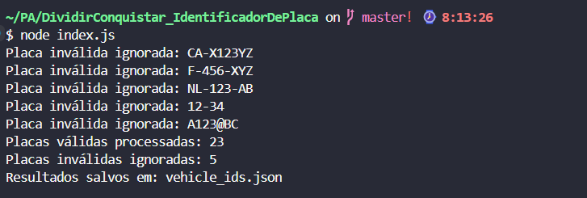
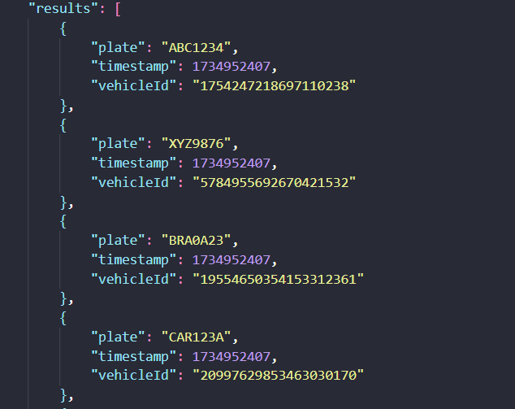
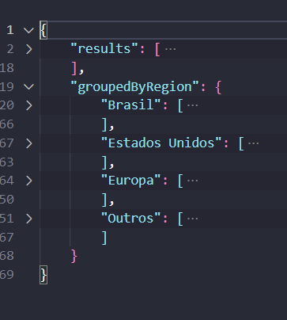

# Identificador de Placa por Timestamp

**Número da Lista**: D&C 
**Conteúdo da Disciplina**: Dividir e Conquistar 

## Alunos

| Matrícula  | Aluno                          |
| ---------- | ------------------------------ |
| 19/0115564 | Pedro Lucas Siqueira Fernandes |
| 19/0030755 | João Paulo Lima da Silva       |

## Sobre

O objetivo do projeto é gerar um identificador único que possa ser obtido de forma simples através da multiplicação de Karatsuba entre a Placa do Veículo com o timestamp no momento do registro, podendo assim ser decomposto para identificar a placa e o timestamp.

## Screenshots

## Vídeo de Apresentação

[Video de Apresentação](https://www.youtube.com/watch?v=AGWw7xzd05Q)

## Instalação

**Linguagem**: JavaScript 

É necessário ter o node instalado.

## Uso

A Execução é bem simples, basta executar node _nomeDoArquivo_ (index.js) que será gerado um arquivo JSON com as respostas das placas que estão presentes na variável plates, que pode ser alterada livremente.
